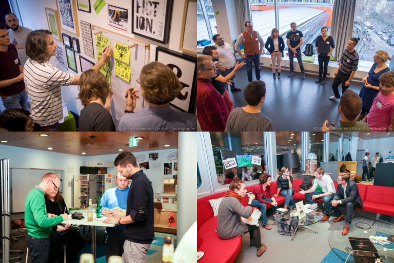
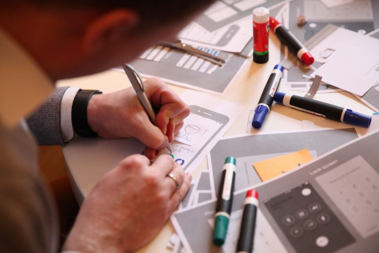
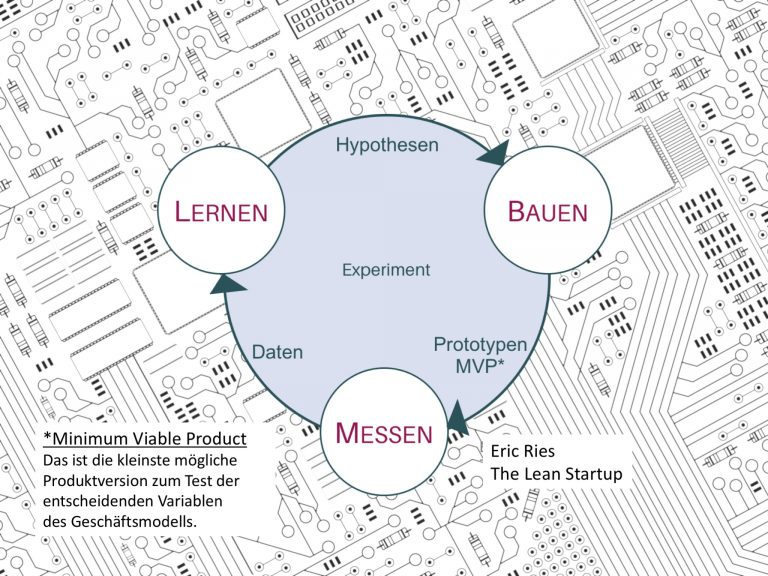
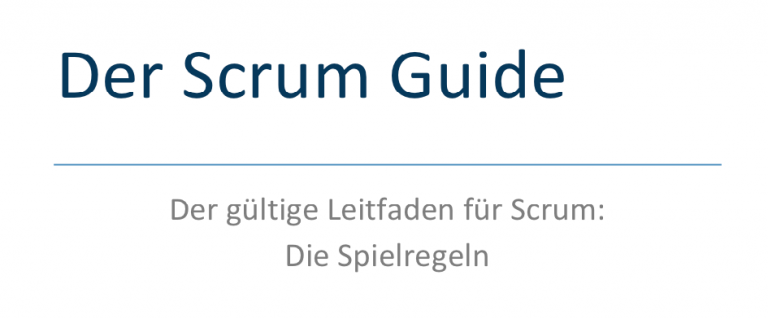

Im Seminar schaffen wir ein sicheres Verständnis für das Konzept von Agilität. Ihr werdet in Zukunft die Aufforderung "agiler arbeiten" mitsamt Untertönen gut einordnen können. Bestenfalls steigt ihr dann ins Gespräch ein, wie viel Agilität und welche Methodik der Situation angemessen sind. Dazu bekommt ihr in den zwei Tagen einen Überblick zu wichtigen agilen Methoden und erprobt selbst agile Werkzeuge und Praktiken.

Agile Methoden 
- [Design Thinking](#Design Thinking)
- Design Sprint
- [Lean Startup](#Lean Startup)
- [Scrum](#Scrum)
- Business Model Generation
- [Kanban](#kanban)

Bei weitergehendem Interesse ist jede dieser Methoden eine eigenständige Vertiefung Wert. Um sie gut zu beherrschen, braucht es das Wechselspiel von Theorie, praktischem Erfahren und Reflektieren.

Wir sehen uns an den zwei Tagen Design Thinking, Scrum und Kanban genauer an, streifen bei Interesse den Lean Startup Ansatz und vertiefen einige der agilen Bausteine in praktischen Übungen. Wir lernen diese in ihrer Wirkungsweise und ihren Voraussetzungen kennen. Je nach Interesse sind das:

Agile Werkzeuge und Praktiken
- Daily
- Retrospektive
- Taskboard
- Sprint
- Protoyping
- Planning Poker
- User Story

Agile Event Formate
- Lean Coffee
- Open Space
- Fishbowl

Agile Methoden lassen sich besser durch eigenes Erleben, als mit einem Buch in der Hand begreifen. Übung, spielerisches Ausprobieren werden daher Seminarschwerpunkt sein. Zum leichteren Einstieg empfehle ich, vorab schon einen Blick in die Original-Texte zu werfen und einige Videos anzusehen. Wenn beim Lesen etwas unverständlich oder zweifelhaft erscheint, notiere dir Fragen oder deinen Eindruck, wir tauschen uns im Seminar dazu aus.

 
_Übungsbeispiel zu agilen Prinzipien_

Agilität beruht auf Werten und Prinzipien, die stark verdichtet im Agilen Manifest zusammengefasst wurden. 

## Agilität

In verschiedenen Disziplinen haben sich unabhängig voneinander agile Arbeitsweisen herausgebildet. Vor allem in der Softwareentwicklung entstanden neuartige Prinzipien, die man unter der Bezeichnung „agil“ einordnet. Verfechter unterschiedlicher Ansätze kamen 2001 in der Abgeschiedenheit der Rocky Mountains zusammen, um sich über die gemeinsamen Grundsätze klar zu werden. Sie haben ihre Ergebnisse in einem „Agilen Manifest“ festgehalten. Bis heute folgen überall auf der Welt Menschen diesen Grundsätzen in ihrer Arbeit an neuen Ideen, Services und Produkten.

### Manifest für Agile Produktentwicklung

Wir erschließen bessere Wege, Produkte zu entwickeln,
indem wir es selbst tun und anderen dabei helfen.
Durch diese Tätigkeit haben wir diese Werte zu schätzen gelernt:

> **Individuen und Interaktionen** mehr als Prozesse und Werkzeuge 
> **Funktionierende Produkte** mehr als umfassende Dokumentation 
> **Zusammenarbeit mit dem Kunden** mehr als Vertragsverhandlung 
> **Reagieren auf Veränderung** mehr als das Befolgen eines Plans
  
Das heißt, obwohl wir die Werte auf der rechten Seite wichtig finden,
schätzen wir die Werte auf der linken Seite höher ein.

Anstelle der allgemeineren Produktentwicklung stand ursprünglich Softwareentwicklung. Bei Produkten kann es sich um physische, digitale Produkte oder auch Dienstleistungen oder Prozesse handeln. 
Quelle: [http://agilemanifesto.org/iso/de/manifesto.html](http://agilemanifesto.org/iso/de/manifesto.html)_

### Prinzipien hinter dem Agilen Manifest

Wir folgen diesen Prinzipien:

Unsere höchste Priorität ist es, 
den Kunden durch frühe und kontinuierliche Auslieferung 
wertvoller Produkte zufrieden zu stellen.

Heiße Anforderungsänderungen selbst spät 
in der Entwicklung willkommen. Agile Prozesse nutzen Veränderungen 
zum Wettbewerbsvorteil des Kunden.

Liefere funktionierende Software 
regelmäßig innerhalb weniger Wochen oder Monate und 
bevorzuge dabei die kürzere Zeitspanne.

Fachexperten und Entwickler 
müssen während des Projektes 
täglich zusammenarbeiten.

Errichte Projekte rund um motivierte Individuen. 
Gib ihnen das Umfeld und die Unterstützung, die sie benötigen 
und vertraue darauf, dass sie die Aufgabe erledigen.

Die effizienteste und effektivste Methode, Informationen 
an und innerhalb eines Entwicklungsteams zu übermitteln, 
ist im Gespräch von Angesicht zu Angesicht.

Funktionierende Software ist das 
wichtigste Fortschrittsmaß.

Agile Prozesse fördern nachhaltige Entwicklung. 
Die Auftraggeber, Entwickler und Benutzer sollten ein 
gleichmäßiges Tempo auf unbegrenzte Zeit halten können.

Ständiges Augenmerk auf technische Exzellenz und 
gutes Design fördert Agilität.

Einfachheit — die Kunst, die Menge nicht 
getaner Arbeit zu maximieren — ist essenziell.

Die besten Architekturen, Anforderungen und Entwürfe 
entstehen durch selbstorganisierte Teams.

In regelmäßigen Abständen reflektiert das Team, 
wie es effektiver werden kann und passt sein 
Verhalten entsprechend an.

_Quelle: [http://agilemanifesto.org/iso/de/principles.html](http://agilemanifesto.org/iso/de/principles.html)_

Diese Prinzipien scheinen beim Lesen schnell eingängig und logisch. In der Umsetzung brauchen sie jedoch einige Lernschleifen im Team und bei Stakeholdern, damit die erwünschte Wirkung erzielt wird. Agilität funktioniert nicht ohne diese Werte, gleich welche Methodik verfolgt wird. Ich habe einmal gelesen, Agilität ohne die Werte ist wie Kochen ohne Gewürze. (Leider weiß ich nicht mehr wo das war.)

### Agile Methoden Definitionen

- **Design Thinking**: Strukturierte Herangehensweise und Sammlung von Werkzeugen zur kreativen, kundenorientierten Lösung komplexer Gestaltungsaufgaben
- **Design Sprint**: 3-5tägiger Prozess mit dem Ziel, ein innovatives Produkt oder die Weiterentwicklung eines Produktes in kürzester Zeit (3-5 Tage) in einem Team und unter Zuhilfenahme von Nutzerfeedback zu testen.
- **Lean Startup**: Entwicklung von neuartigen Produkten und Services durch experimentelle Validierung von Ideen bis zu einem reproduzierbaren Geschäftsmodell
- **Scrum**: Methodisches Rahmenwerk zur iterativen Produktentwicklung durch sich selbst organisierende Teams
- **Kanban**: Methode zur Steuerung und Optimierung von Produktions- oder Serviceprozessen

Auch wenn die agilen Prinzipien die gemeinsame Wurzel dieser Methoden sind, folgen sie alle anderen Prozessen und Arbeitsweisen. Teile der dabei verwendeten Routinen und Instrumente werden inzwischen aus dem ursprünglichen Rahmen herausgelöst und für sich genommen als Unterstützung für eine agilere Arbeitsweise oder New Work verwendet.

Dazu zählen das Daily Stand-up, das Taskboard oder die Retrospektive. Ein Stand-up ist auf den ersten Blick gesehen eine Gruppe von Menschen, die sich regelmäßig stehend über den erreichten Stand und die nächsten Schritte in einem Projekt austauscht. Damit aus einem solchen Element Agilität erwachsen kann, ist es sinnvoll, seinen Platz in ein oder zwei der agilen Methoden besser zu verstehen. Das werden wir im Verlauf des Workshops tun.

 
_Typische Muster agiler Arbeitsweisen_

## Design Thinking

### Design Thinking ist Methode der Wahl
 
- Zur Lösung für komplexe Aufgabe- oder Problemstellungen in unübersichtlichen Kontexten;
- Für die Entwicklung von Innovationen mit einer besonderen Attraktivität und hohem praktischen Wert für die Nutzer
- Zur grundsätzlichen Neugestaltung von Produkten, Dienstleistungen oder Veranstaltungen

Der besondere Erfolg des Design Thinking entsteht durch die gleichgewichtige Berücksichtigung menschlicher Bedürfnisse neben den sonst meist im Vordergrund stehenden Zielen ökonomischer Erfolg und technischer Machbarkeit. Soll die Benutzung eines Produktes oder eines Serviceangebots Freude bereiten und den Nutzern Identifikationsmöglichkeiten bieten, dann kommt es bei ihrer Entwicklung auf ein besonders hohes Einfühlungsvermögen für den Personenkreis an. Empathie ist der Schlüssel für einen guten Design Thinking Prozess. Sie macht auch die besondere Eignung der Methode für soziale Gestaltungsaufgaben aus, wie innerbetriebliche Kommunikations- und Informationsangebote oder auch kommunale Verkehrslösungen, bei denen die Interessen von Fußgängern, Rad- und Autofahrern typischerweise zuwiderlaufen.
 
 
_Design Thinking: Person fertig Skizzen für App auf Papier an_

### Was ist Design Thinking?

Design Thinking ist eine kreative Arbeitsmethode zur innovativen Lösung komplexer Fragestellungen, die sich auf drei Säulen stützt:

- **Mindset**: Eine explorative Denkhaltung und kooperative Arbeitsweise, die Gewohntes hinterfragt und sich mit einfachen Antworten nicht zufriedengibt, sondern nach tieferliegenden Bedürfnissen und Motiven der Nutzer schaut, um die jeweils gestellte Ausgangsfrage auf neuartige Weise zu lösen.
- **Prozess**: Ein iterativer, strukturierter Prozess aus verschiedenen Phasen der Öffnung (Divergenz) und Phasen fokussierten Denkens (Konvergenz).
- **Werkzeugkasten** von Kreativtechniken, aus dem sich Design Thinker je nach Aufgabe und Phase bedienen, dazu gehören Visualisierung, Prototypenbau und Storytelling.

Im Unterschied zum weit verbreiteten Verständnis von Design als der Gestaltung von Oberflächen und rein sensorischen Qualitäten, geht es im Design Thinking zunächst um den Zweck oder Nutzwert eines Produktes. Der beste Zeitpunkt ist demnach früh in der Entwicklung oder beim Neudenken von bestehenden Lösungen. Ungeeignet wäre Design Thinking am Ende eines solchen Prozesses, wenn Funktionalität und Gebrauchseigenschaften schon feststehen und es lediglich um die Attraktivität im Verkauf eines Produktes geht. Der Charakter und erhebliche Aufwand zur Durchführung eines Design Thinking Prozesses legen es nahe, diesen Ansatz für grundlegende und offene Fragestellungen einzusetzen. Für graduelle Verbesserungen von etwas Bestehendem gibt es andere, effektive Techniken, z.B. Scamper.[1]

[1] [https://de.wikipedia.org/wiki/SCAMPER](https://de.wikipedia.org/wiki/SCAMPER), [http://www.ideenfindung.de/SCAMPER-Kreativit%C3%A4tstechnik-Brainstorming-Ideenfindung.html](http://www.ideenfindung.de/SCAMPER-Kreativit%C3%A4tstechnik-Brainstorming-Ideenfindung.html)

Wer weiter eintauchen möchte, dem empfehle ich:
HPI schriftliche Einführung
- **Überblick** https://hpi.de/school-of-design-thinking/design-thinking/was-ist-design-thinking.html
- **Prozess** https://hpi.de/school-of-design-thinking/design-thinking/hintergrund/design-thinking-prozess.html

Ein anschauliches Anwendungsbeispiel erklärt ein Airbus Design-Thinking-Team: Video https://youtu.be/RA-PrfiSYf0 (Dauer 5:27 min, ab 4:00 kommen Würdigungen)
In der amerikanischen Reportage bekommt man zusätzlich Live-Eindrücke von IDEO: https://youtu.be/M66ZU2PCIcM (Dauer 8 min)
Ein kurzes, deutschsprachiges Video, in dem die Inhalte der Prozessstufen erklärt werden: https://youtu.be/O6Dl8ri9Lik

## Lean Startup

Wer sich der Umsetzung einer bis dahin unbekannten Geschäftsidee verschrieben hat und das hohe persönliche Risiko einer Unternehmensgründung auf der Basis eines innovativen Produktes eingeht, verfügt in der Regel über eine hochmotivierte Persönlichkeit und identifiziert sich stark mit der jeweiligen Idee.

Wie jeder menschliche Zug haben auch diese Stärken ihre Schattenseiten. Ein großes Ego verleitet zum Ausblenden von negativen Signalen. Der wunschgeleitete Blick sucht nach Bestätigung, Kritik wird tendenziell übersehen, Ablehnung stachelt den Ehrgeiz an, die Produktentwicklung noch weiter voranzutreiben. Wenn erst das richtige Design gefunden wurde, wenn erst alle Funktionen umgesetzt sind, dann…

 
_Experiment-Zyklus im Lean Startup Ansatz_

Die eigene Erfahrung in Technologie-Startups und die Beobachtung vieler Gründer führten Eric Ries zur Feststellung, dass es im Gründungsprozess nicht allein um die Verwirklichung einer herausragenden Produktidee, sondern vielmehr darum geht, ein verlässlich wiederholbares und skalierbares Geschäftsmodell aufzubauen. Für ein Lean Startup kommt es zunächst nicht darauf an, einzelne Kunden für ein perfektes Produkt zu begeistern, sondern Wege zu finden, nach denen verlässlich prognostizierbar immer wieder neue, zahlende Kunden gewonnen werden.

Bevor jemand an Wachstum oder Skalierung denkt, sollte das Geschäftsmodell erwiesen haben, dass es reproduzierbar Gewinne erzielen kann. Für einen solchen Nachweis reicht gründliches Recherchieren nicht, ebensowenig Expertenbefragungen. Ein funktionierendes Geschäftsmodell besteht aus vielen kleinen Puzzlesteinen, auf deren gemeinsame Passung es aus Kundensicht allein ankommt. Im Unterschied zu einem etablierten Geschäftsmodell befinden sich in neuen Märkten auf vielen dieser Puzzlesteine Fragezeichen. Diese Ungewissheit systematisch zu reduzieren, ist Ziel des Lean Startup Ansatzes.

## Scrum

Scrum ist die bekannteste der agilen Methoden. Das Scrum Framework diente anfangs der Entwicklung von Software. Inzwischen wird Scrum in vielen anderen Feldern in Projekten eingesetzt. Anhand dieser Methode lässt sich das Zusammenwirken von Prinzipien, Rollen und Prozessen gut nachvollziehen. Wir werden im Verlauf des Seminars darauf eingehen und spielerisch üben.

 
_Titel der deutschen Fassung des Scrum Guide von 2020_

Der [Scrum-Guide](https://www.scrumguides.org/docs/scrumguide/v2020/2020-Scrum-Guide-German.pdf) fasst kompakt auf gut 20 Seiten die Grundregeln der agilen Entwicklungsmethode zusammen. Er wird durch Jeff Sutherland und Ken Schwaber, die zu den Begründern von Scrum gehören, seit 20 Jahren weiterentwickelt. Anhand dieser Methode lässt sich das Zusammenwirken von agilen Prinzipien, Rollen und Prozessen gut nachvollziehen. Ich werden im Seminar nur einen kurzen Überblick zu dem Rahmenwerk geben. Wichtiger als Vollständigkeit ist das Verständnis für Begriffe und das Zusammenspiel von Rollen, Ritualen und Prinzipien.  

Zum schnellen Video Einstieg:
Gutes, kompaktes Video zu Scrum in englisch 12 min: https://youtu.be/Z9QbYZh1YXY 
Eine knappere, deutsche Scrum Erklärung findet ihr in dem Video 3:33 min: https://youtu.be/Ibz9STVjtzI 

## Kanban

Kanban ist eine aus Japan stammende lean Methodik für die Optimierung und Verschlankung von Prozessketten. Kanban fand ursprünglich in Fertigungs- und Logistikprozessen Anwendung. Zwischenzeitlich nutzen auch Service- und Kreativbereiche Elemente der Methodik. Im Kern optimiert Kanban die Wertschöpfung eines Prozesses, in dem evidenzbasiert gelernt und iterativ ein gleichmäßiger, störungsfreier Durchfluss der einzelnen Aufträge durch die Prozessstufen erzielt wird.

Anfänge der übrigen agilen Methoden basierten stark auf den Grundelementen von Kanban. Häufig verwendet Scrum das zentrale Kanban-Board, die Kanban-Karten und entlehnt Kennziffern, wie Work in Progress und Durchlaufzeiten.

Bei stärkerem Interesse empfehle ich den Kanban Guide for Scrum Teams. Hier zum Download https://kanbanguides.org/ in englischer Sprache.

Schneller Video-Einstieg: https://youtu.be/ndWPFk7GR8k von it-agile 7 min.
