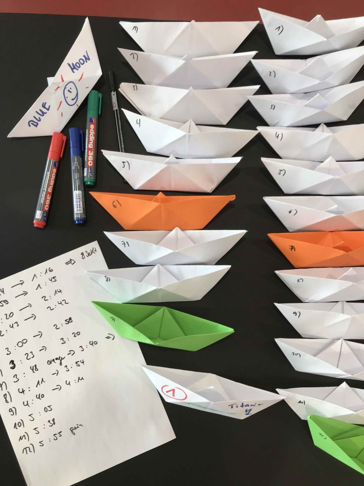

Die zwei Seminartage „Agile Arbeitsmethoden“ schaffen Verständnis für die begriffliche Wolke Agilität, für den erklingenden Ruf nach agilerem Arbeiten und einen Überblick zu wichtigen agilen Methoden:
- Design Thinking
- Scrum
- Kanban
- Lean Startup
- Business Model Generation

Bei weitergehendem Interesse ist jede dieser Methoden eine eigenständige Vertiefung Wert und vor allem kontinuierliches Wechselspiel von Lernen, praktischem Erfahren und Reflektieren.

Wir vertiefen an den zwei Tagen einige agile Techniken oder Praktiken. Wir lernen sie in ihrer Wirkungsweise kennen und sprechen dabei genau über die Voraussetzungen für die erfolgreiche Anwendung. Je nach Interesse geht können das sein:
- Daily
- Retrospektive
- Taskboard
- Sprint
- Protoyping
- Planning Poker
- User Story
- Lean Coffee
- Open Space

Agile Methoden lassen sich besser durch eigenes Erleben, als mit einem Buch in der Hand begreifen. Da sie mit einer Reihe von neuen Begriffen verbunden sind, ist es dennoch nützlich, vorab schon einen Blick in die Original-Texte zu werfen. Wir werden im Workshop die Begriffe und Konzepte Schritt für Schritt nachvollziehen. Wenn Ihnen beim Lesen manche Aussagen unverständlich oder zweifelhaft erscheinen, notieren Sie sich Ihren Eindruck und wir tauschen uns vor Ort dazu aus.

 
_Übungsbeispiel zu agilen Prinzipien_

Agiles Arbeiten beruht vor allem auf bestimmten Werten und Prinzipien, die im Agilen Manifest beschrieben werden.

### Agiles Manifest und Agile Prinzipien

In verschiedenen Disziplinen haben sich unabhängig voneinander agile Ansätze herausgebildet. Vor allem in der Softwareentwicklung entstanden neuartige Arbeitsweisen, die man unter der Bezeichnung „agil“ einordnet. Verfechter unterschiedlicher Ansätze kamen 2001 in der Abgeschiedenheit der Rocky Mountains zusammen, um sich über die gemeinsamen Grundsätze klar zu werden. Sie haben ihre Ergebnisse in einem „Agilen Manifest“ festgehalten. Bis heute folgen überall auf der Welt Menschen diesen Grundsätzen in ihrer Arbeit an neuen Ideen, Services und Produkten.

## Manifest für Agile Produktentwicklung

Wir erschließen bessere Wege, Produkte zu entwickeln,
indem wir es selbst tun und anderen dabei helfen.
Durch diese Tätigkeit haben wir diese Werte zu schätzen gelernt:

> **Individuen und Interaktionen** mehr als Prozesse und Werkzeuge 
> **Funktionierende Produkte** mehr als umfassende Dokumentation 
> **Zusammenarbeit mit dem Kunden** mehr als Vertragsverhandlung 
> **Reagieren auf Veränderung** mehr als das Befolgen eines Plans
  
Das heißt, obwohl wir die Werte auf der rechten Seite wichtig finden,
schätzen wir die Werte auf der linken Seite höher ein.

Anstelle der allgemeineren Produktentwicklung stand ursprünglich Softwareentwicklung. Bei Produkten kann es sich um physische, digitale Produkte oder auch Dienstleistungen oder Prozesse handeln. 
Quelle: [http://agilemanifesto.org/iso/de/manifesto.html](http://agilemanifesto.org/iso/de/manifesto.html)_

## Prinzipien hinter dem Agilen Manifest

Wir folgen diesen Prinzipien:

Unsere höchste Priorität ist es,
den Kunden durch frühe und kontinuierliche Auslieferung
wertvoller Produkte zufrieden zu stellen.

Heiße Anforderungsänderungen selbst spät
in der Entwicklung willkommen. Agile Prozesse nutzen Veränderungen
zum Wettbewerbsvorteil des Kunden.

Liefere funktionierende Software
regelmäßig innerhalb weniger Wochen oder Monate und
bevorzuge dabei die kürzere Zeitspanne.

Fachexperten und Entwickler
müssen während des Projektes
täglich zusammenarbeiten.

Errichte Projekte rund um motivierte Individuen.
Gib ihnen das Umfeld und die Unterstützung, die sie benötigen
und vertraue darauf, dass sie die Aufgabe erledigen.

Die effizienteste und effektivste Methode, Informationen
an und innerhalb eines Entwicklungsteams zu übermitteln,
ist im Gespräch von Angesicht zu Angesicht.

Funktionierende Software ist das
wichtigste Fortschrittsmaß.

Agile Prozesse fördern nachhaltige Entwicklung.
Die Auftraggeber, Entwickler und Benutzer sollten ein
gleichmäßiges Tempo auf unbegrenzte Zeit halten können.

Ständiges Augenmerk auf technische Exzellenz und
gutes Design fördert Agilität.

Einfachheit — die Kunst, die Menge nicht
getaner Arbeit zu maximieren — ist essenziell.

Die besten Architekturen, Anforderungen und Entwürfe
entstehen durch selbstorganisierte Teams.

In regelmäßigen Abständen reflektiert das Team,
wie es effektiver werden kann und passt sein
Verhalten entsprechend an.

Diese Prinzipien scheinen beim ersten Lesen schnell eingängig und logisch. In der Umsetzung brauchen sie einige Iterationen an Verständnis im agilen Team und bei dessen Stakeholdern, damit die erwünschte Wirkung: Agilität - wirklich erzielt wird.
_Quelle: [http://agilemanifesto.org/iso/de/principles.html](http://agilemanifesto.org/iso/de/principles.html)_

## Agile Methoden und Arbeitsweisen

Diesen Prinzipien folgen verschiedene, jeweils auf unterschiedliche Zielsetzungen und Zielgruppen ausgerichtete Methoden, wie zum Beispiel

- **Design Thinking**: Strukturierte Herangehensweise und Sammlung von Techniken zur kreativen Lösung komplexer Herausforderungen
- **Design Sprint** ist ein fünftägiger Prozess mit dem Ziel, ein Produkt oder die Weiterentwicklung eines Produktes in kürzester Zeit (3-5 Tage) in einem Team und unter Zuhilfenahme von User-Input zu testen.
- **Lean Startup**: Entwicklung von neuartigen Produkten und Services durch experimentelle Validierung von Ideen bis zu einem reproduzierbaren Geschäftsmodell
- **Scrum**: Methodisches Rahmenwerk zur iterativen Produktentwicklung durch sich selbst organisierende Teams
- **Kanban**: Methode zur Steuerung und Optimierung von Produktions- oder Serviceprozessen

Auch wenn die agilen Prinzipien eine gemeinsame Wurzel sind, stützt sich jede Methode auf eigene Prozesse und Arbeitsweisen. Teile der dabei verwendeten Routinen und Instrumente werden inzwischen aus dem ursprünglichen Rahmen herausgelöst und für sich genommen als Unterstützung für eine agilere Arbeitsweise oder New Work verwendet.

Dazu zählen das Daily Stand-up, das Taskboard oder die Retrospektive. Ein Stand-up ist auf den ersten Blick gesehen eine Gruppe von Menschen, die sich regelmäßig stehend über den erreichten Stand und die nächsten Schritte in einem Projekt austauscht. Damit aus einem solchen Element Agilität erwachsen kann, ist es sinnvoll, seinen Platz in ein oder zwei der agilen Methoden besser zu verstehen. Das werden wir im Verlauf des Workshops tun.

 
_Typische Muster agiler Arbeitsweisen_

## Design Thinking ist die Methode der Wahl …
 
- Zur Lösung für komplexe Aufgabe- oder Problemstellungen in unübersichtlichen Kontexten;
- Für die Entwicklung von Innovationen mit einer besonderen Attraktivität und hohem praktischen Wert für die Nutzer
- Zur grundsätzlichen Neugestaltung von Produkten, Dienstleistungen oder Veranstaltungen

Der besondere Erfolg des Design Thinking entsteht durch die gleichgewichtige Berücksichtigung menschlicher Bedürfnisse neben den sonst meist im Vordergrund stehenden Zielen ökonomischer Erfolg und technischer Machbarkeit. Soll die Benutzung eines Produktes oder eines Serviceangebots Freude bereiten und den Nutzern Identifikationsmöglichkeiten bieten, dann kommt es bei ihrer Entwicklung auf ein besonders hohes Einfühlungsvermögen für den Personenkreis an. Empathie ist der Schlüssel für einen guten Design Thinking Prozess. Sie macht auch die besondere Eignung der Methode für soziale Gestaltungsaufgaben aus, wie innerbetriebliche Kommunikations- und Informationsangebote oder auch kommunale Verkehrslösungen, bei denen die Interessen von Fußgängern, Rad- und Autofahrern typischerweise zuwiderlaufen.
 
 
_Design Thinking: Person fertig Skizzen für App auf Papier an_

## Was ist Design Thinking?

Design Thinking ist eine kreative Arbeitsmethode zur innovativen Lösung komplexer Fragestellungen, die sich auf drei Säulen stützt:

- **Mindset**: Eine explorative Denkhaltung und kooperative Arbeitsweise, die Gewohntes hinterfragt und sich mit einfachen Antworten nicht zufriedengibt, sondern nach tieferliegenden Bedürfnissen und Motiven der Nutzer schaut, um die jeweils gestellte Ausgangsfrage auf neuartige Weise zu lösen.
- **Prozess**: Ein iterativer, strukturierter Prozess aus verschiedenen Phasen der Öffnung (Divergenz) und Phasen fokussierten Denkens (Konvergenz).
- **Werkzeugkasten** von Kreativtechniken, aus dem sich Design Thinker je nach Aufgabe und Phase bedienen, dazu gehören Visualisierung, Prototypenbau und Storytelling.

Im Unterschied zum weit verbreiteten Verständnis von Design als der Gestaltung von Oberflächen und rein sensorischen Qualitäten, geht es im Design Thinking zunächst um den Zweck oder Nutzwert eines Produktes. Der beste Zeitpunkt ist demnach früh in der Entwicklung oder beim Neudenken von bestehenden Lösungen. Ungeeignet wäre Design Thinking am Ende eines solchen Prozesses, wenn Funktionalität und Gebrauchseigenschaften schon feststehen und es lediglich um die Attraktivität im Verkauf eines Produktes geht. Der Charakter und erhebliche Aufwand zur Durchführung eines Design Thinking Prozesses legen es nahe, diesen Ansatz für grundlegende und offene Fragestellungen einzusetzen. Für graduelle Verbesserungen von etwas Bestehendem gibt es andere, effektive Techniken, z.B. Scamper.[1]

[1] [https://de.wikipedia.org/wiki/SCAMPER](https://de.wikipedia.org/wiki/SCAMPER), [http://www.ideenfindung.de/SCAMPER-Kreativit%C3%A4tstechnik-Brainstorming-Ideenfindung.html](http://www.ideenfindung.de/SCAMPER-Kreativit%C3%A4tstechnik-Brainstorming-Ideenfindung.html)

## Die Grundhaltung im Lean Startup

Wer sich der Umsetzung einer bis dahin unbekannten Geschäftsidee verschrieben hat und das hohe persönliche Risiko einer Unternehmensgründung auf der Basis eines innovativen Produktes eingeht, verfügt in der Regel über eine hochmotivierte Persönlichkeit und identifiziert sich stark mit der jeweiligen Idee.

Wie jeder menschliche Zug haben auch diese Stärken ihre Schattenseiten. Ein großes Ego verleitet zum Ausblenden von negativen Signalen. Der wunschgeleitete Blick sucht nach Bestätigung, Kritik wird tendenziell übersehen, Ablehnung stachelt den Ehrgeiz an, die Produktentwicklung noch weiter voranzutreiben. Wenn erst das richtige Design gefunden wurde, wenn erst alle Funktionen umgesetzt sind, dann…

 
_Experiment-Zyklus im Lean Startup Ansatz_

Die eigene Erfahrung in Technologie-Startups und die Beobachtung vieler Gründer führten Eric Ries zur Feststellung, dass es im Gründungsprozess nicht allein um die Verwirklichung einer herausragenden Produktidee, sondern vielmehr darum geht, ein verlässlich wiederholbares und skalierbares Geschäftsmodell aufzubauen. Für ein Lean Startup kommt es zunächst nicht darauf an, einzelne Kunden für ein perfektes Produkt zu begeistern, sondern Wege zu finden, nach denen verlässlich prognostizierbar immer wieder neue, zahlende Kunden gewonnen werden.

Bevor jemand an Wachstum oder Skalierung denkt, sollte das Geschäftsmodell erwiesen haben, dass es reproduzierbar Gewinne erzielen kann. Für einen solchen Nachweis reicht gründliches Recherchieren nicht, ebensowenig Expertenbefragungen. Ein funktionierendes Geschäftsmodell besteht aus vielen kleinen Puzzlesteinen, auf deren gemeinsame Passung es aus Kundensicht allein ankommt. Im Unterschied zu einem etablierten Geschäftsmodell befinden sich in neuen Märkten auf vielen dieser Puzzlesteine Fragezeichen. Diese Ungewissheit systematisch zu reduzieren, ist Ziel des Lean Startup Ansatzes.

## Scrum

Scrum ist wohl die bekannteste der agilen Methoden. Sie stammt aus der Entwicklung vor allem von Softwareprodukten. Inzwischen wird Scrum in vielen anderen Feldern in Projekten eingesetzt. Anhand dieser Methode lässt sich das Zusammenwirken von Prinzipien, Rollen und Prozessen gut nachvollziehen. Wir werden im Verlauf des Trainingsworkshops darauf eingehen.

 
_Titel der deutschen Fassung des Scrum Guide von 2016_

Der [Scrum-Guide](https://www.scrumguides.org/docs/scrumguide/v2016/2016-Scrum-Guide-German.pdf) fasst kompakt auf 20 Seiten die wesentlichen Punkte der agilen Entwicklungsmethode zusammen. Er wird durch Jeff Sutherland und Ken Schwaber, die zu den Begründern von Scrum gehören, seit 20 Jahren weiterentwickelt. Anhand dieser Methode lässt sich das Zusammenwirken von agilen Prinzipien, Rollen und Prozessen gut nachvollziehen. Wir werden im Seminar einen Überblick zu dem Rahmenwerk geben. Genaueren Einblick gibt der Scrum Guide.
