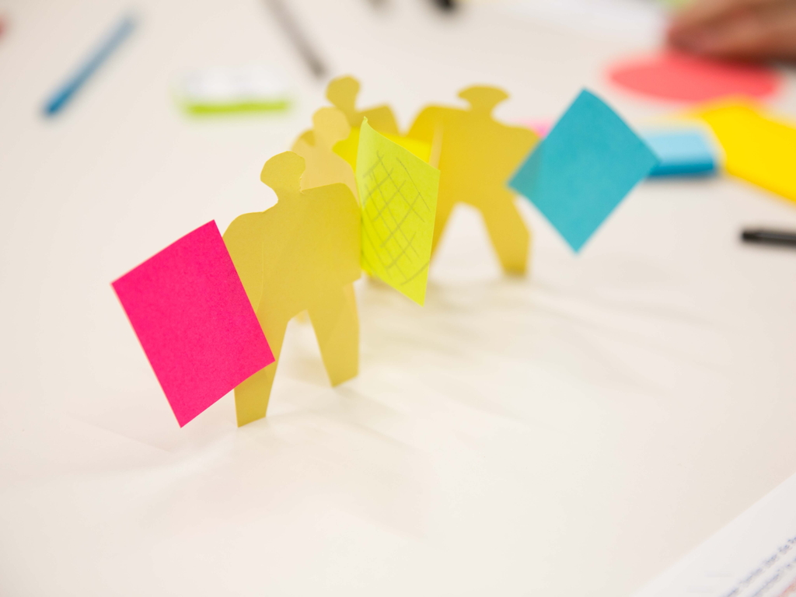

<cite>Annette Hornischer / IG Metall / Hans Böckler Stiftung / Engineering Tagung / 2016 11 22</cite>

Mit Projekten kennen sich Ihre Mitarbeiter aus. Doch in der Zusammenarbeit der Fachbereiche mit IT-Spezialisten und 
Dienstleistern entstehen Kommunikations- und Reibungsverluste. Agilität heißt nicht Trial & Error.

Agile Projekt benötigen ein belastbares Setup und Zielverständnis. Ein Externer erkennt oft schneller, wo Verständnis 
und Interessen abweichen. Wir bringen jahrelange Projekterfahrung aus der Softwareentwicklung und Online Marketing mit, 
um Ihr Digitalisierungsprojekt gut aufzustellen.

[Zurück](./)
[Kontakt](./#kontakt)
