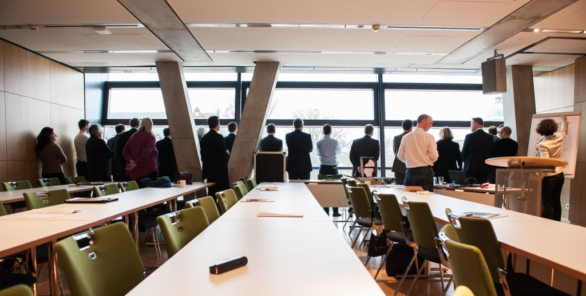

Ausblick und Herausforderungen der Digitalisierung für das zukünftige Personalmanagement. Wir wirken sich digitale 
Technologien und Industrie 4.0 auf Beschäftigung und Personalarbeit aus.

Seminare und individuell geplante Workshops zur Positionsbestimmung und Ausrichtung auf die Rolle als Enabler für die 
anstehenden Veränderungen in der Arbeitswelt.

Seminar: [https://www.haufe-akademie.de/22.63](https://www.haufe-akademie.de/22.63)

[Zurück](./)
[Kontakt](./#kontakt)
